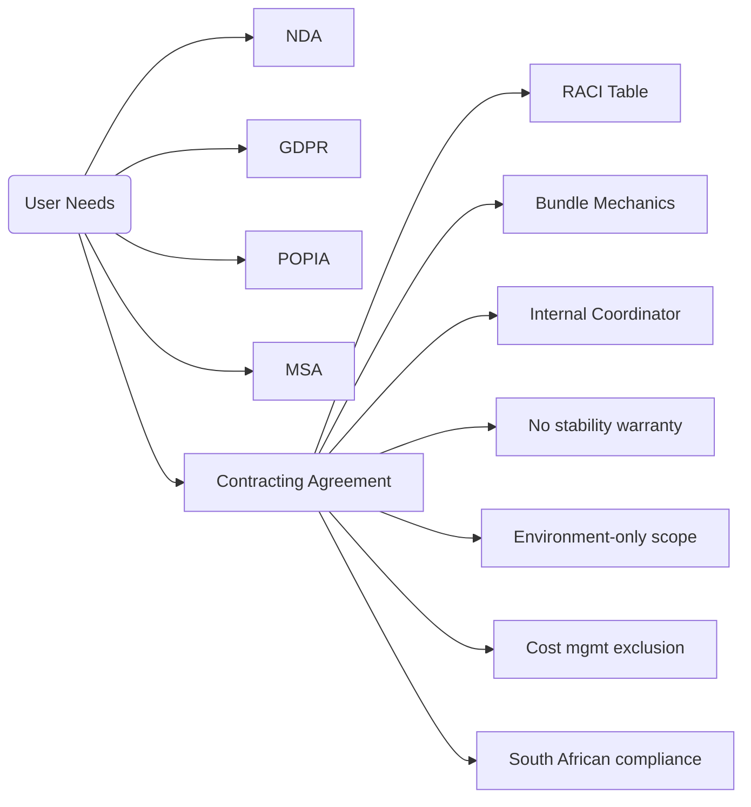

# Logic and Reasoning

## Approach Overview
1. **Interpreted Multi-Document Request:** Confirmed that the user needed five legal instruments plus supporting prompt files, all in a new subfolder.
2. **Structured Deliverables:** Named the folder `deliverables` to hold every file created during this session to satisfy the "any other files" condition.
3. **Document Order:** Drafted legally binding content first (NDA, GDPR DPA, POPIA Addendum, MSA, Contracting Agreement) to anchor downstream references (e.g., Contracting Agreement referencing NDA/DPA/MSA).
4. **Placeholder Strategy:** Preserved user-specified placeholders ("PLACEHOLDER amount" etc.) and introduced descriptive blanks ("_____________") so the templates stay flexible.
5. **Clause Coverage:** Ensured the Contracting Agreement included bundle rules, exclusions, RACI, coordinator duties, third-party warranty disclaimers, cost-management exclusions, and escalation paths.
6. **Compliance Iterations:** Added explicit South African governing-law and compliance clauses across all applicable documents, then simplified `recommendations.md` and `whatnext.md` per the latest instruction.
7. **Meta Documentation:** Updated all prompt-tracking files with each new user message, refreshed the reasoning log, and created the requested guidance materials (prompting guide plus `project_init/project_init.md`).

## Decision Diagram
```mermaid
flowchart TD
    A[Parse User Instructions] --> B{All deliverables in one folder?}
    B -- Yes --> C[Create deliverables directory]
    C --> D[Draft core legal docs]
    D --> E[Insert placeholders + required clauses]
    E --> F[Add compliance addenda]
    F --> G[Compose meta files (prompts, logic, guidance)]
    G --> H[Second-pass updates for SA law + new files]
    H --> I[Plain-English rewrites + prompting guidance]
    I --> J[Verify folder contents and reference in final response]
```

## Clause Mapping


## Validation Checklist
- Confirmed every requested document exists in `deliverables/`, references South African governing law, and uses the specified placeholders.
- Simplified `recommendations.md` and `whatnext.md` into plain English while preserving substantive steps.
- Refreshed `henrys_prompt.md` and `codex_user_prompt.md` with the newest user directives; kept `logic.md` aligned with actual workflow.
- Added `prompting_guidance.md` plus the `project_init/project_init.md` starter example, and updated `index.md` accordingly.
- Verified the index lists each file for easy navigation.
